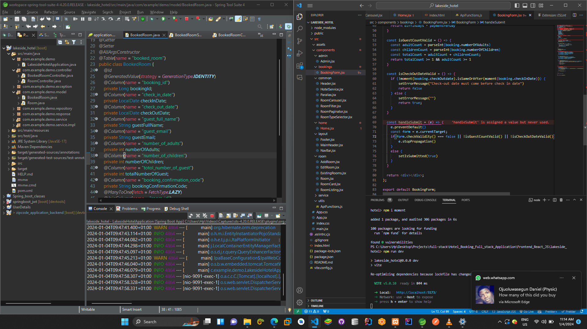

# Hotel Booking Full-stack Application.
Using Springboot and ReactJS

## Backend with springboot

### Dependency
1.  spring-boot-starter-data-jpa
2.  spring-boot-starter-web
3.  spring-boot-devtools
4.  mysql-connector-j
5.  lombok
6.  commons-lang3
7.  spring-boot-starter-validation


### How to run

</hr>
### STEPS:
 
#### STEP 01- Open XAMPP Control Panel and start Apache and MySQL
Note: MySQL run on port <b>3306</b> locally

```bash
i.e localhost:3306
```
create a database with the name <b>zipcode_application_backend</b>


#### STEP 02- Navigate to the project root folder
i.e

```bash
root:\Backend [Springboot]\lakeside_hotel
```


#### STEP 03- In the Backend [Springboot]\lakeside_hotel folder open in cmd and package using 

```bash
mvnw package
```

#### STEP 04- in the In the Backend [Springboot]\lakeside_hotel folder navigate to the target folder and open in cmd 

```bash
java -jar zipcode_application_backend--0.0.1-SNAPSHOT.jar
```

Note: The port has been changed to port 9091
i.e localhost:9091


### <span style="color: green;"> API documentation </span>
#### Base URL 
BASE_URL

```bash
http://localhost:9091/api/v1
```

#### To add new Room

</br>

POST Request

```bash
BASE_URL/room/add/new-room
```

#### To get all Room

</br>

GET Request

```bash
BASE_URL/rooms/room-types
```

#### To delete Room by ID

</br>

DELETE Request

```bash
BASE_URL/rooms/delete/room/{roomId}
```

#### To update Room by ID

</br>

PUT Request

```bash
BASE_URL/rooms/update/{roomId}
```

#### To get Room by ID

</br>

GET Request

```bash
BASE_URL/rooms/room/{roomId}
```

#### To Book Room

</br>

POST Request

```bash
BASE_URL/bookings/room/{roomId}/booking
```

#### To get all Booked Room

</br>

GET Request

```bash
BASE_URL/bookings/all-bookings
```

#### To get Booked Room by confirmation code

</br>

GET Request

```bash
BASE_URL/bookings/confirmation/{confirmationCode}
```

#### To delete Booked Room by ID

</br>

DELETE Request

```bash
BASE_URL/bookings/booking/{bookingId}/delete
```


## Frontend with React JS

### Dependency
1.  axios
2.  bootstrap
3.  moment
4.  react-bootstrap
5.  react-router-dom
6.  react-icons


### How to run

</hr>
### STEPS:
 
#### STEP 01- Open Project Root Folder using Terminal and navigate to the Frontend_React_JS\lakeside_hotel folder

For windows
```bash
cd Frontend_React_JS\lakeside_hotel
```


#### STEP 02- Run the React Project Using "npm run dev"

```bash
    npm run dev
```


## Screenshot
<div style="display: grid; grid-column: 2;">


</div>
